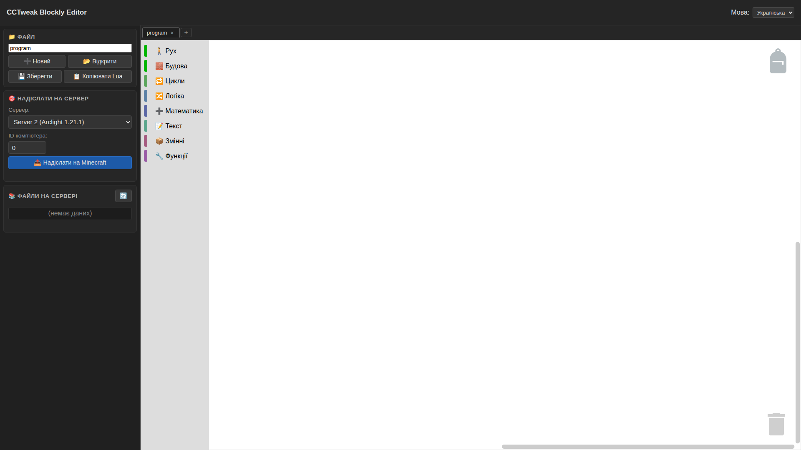
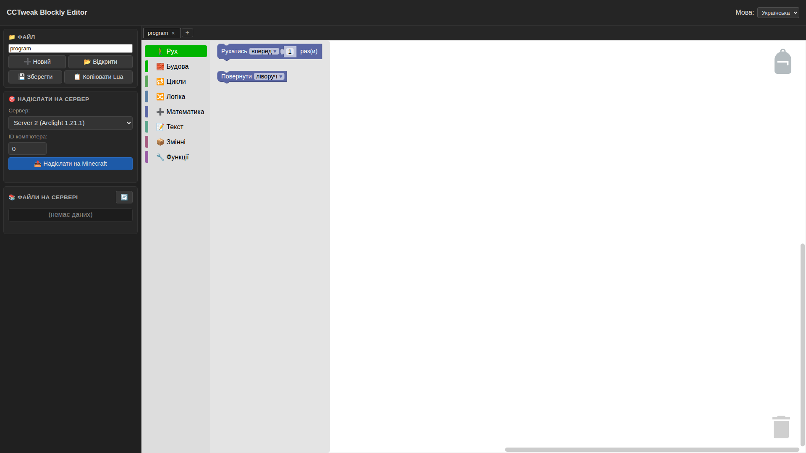

# CCTweak Blockly Editor — гайд по інтерфейсу для уроку «Знайомство»

**Мета документа:** дати методисту повний опис усіх елементів редактора, щоб побудувати урок «Знайомство з інтерфейсом» для дітей-початківців.
**Live:** https://cctweak-blockly.vercel.app/
**Актуальна версія:** 1.1.6 (base) + локальні upgrades (tabs, backpack, redesign panel, Server 3 Lite, i18n UA/EN)
**Створено:** 2026-08-20 (перший опис інтерфейсу).

**Пов'язаний проєкт:** для старших учнів є **текстовий** редактор — [`CCTweak_LuaPageCoding`](/root/projects/CCTweak_LuaPageCoding/) (Ace Editor + text Lua). Цей документ — **тільки про візуальний Blockly**.

---

## Розкладка екрана — 5 великих зон

| # | Зона | Що це |
|---|---|---|
| 1 | **Топ-бар** (зверху) | Логотип «CCTweak Blockly Editor» + перемикач мови (Українська / English) |
| 2 | **Ліва панель** | Керування: файл, сервер, файли на сервері |
| 3 | **Центр — Toolbox** (вузька колонка) | 8 категорій блоків з іконками |
| 4 | **Центр — Workspace** (велика робоча область) | Тут учень складає блоки як пазл |
| 5 | **Праві кути** | 🎒 **Рюкзак** (верхній) + 🗑 **Смітник** (нижній) |

---

## 1. Топ-бар

- **Ліворуч:** назва програми
- **Праворуч:** випадне меню «Мова: Українська / English» — перемикає інтерфейс + назви категорій + назви блоків. Вибір зберігається у пам'яті браузера.

---

## 2. Ліва панель — керування (5 підблоків згори-вниз)

### 2.1 📁 ФАЙЛ

- Поле для назви (типово `program`)
- **`+ Новий`** — створити новий (порожній) файл. Гаряча клавіша: **Ctrl+T** (нова вкладка)
- **`📁 Відкрити`** — завантажити `.ccbe`-файл з диску
- **`💾 Зберегти`** — зберегти поточний workspace як `.ccbe` (спеціальний формат Blockly з блоками + Lua-кодом + датою)
- **`📋 Копіювати Lua`** — скопіювати згенерований Lua-код у буфер обміну (щоб вставити куди-хочеш)

### 2.2 🎯 НАДІСЛАТИ НА СЕРВЕР

- **`Сервер:`** dropdown — вибір з 3 серверів:
  - **Server 1 (Forge 1.20.1)** — навчальний
  - **Server 2 (Arclight 1.21.1)** — новіший
  - **Server 3 (Lite — черепашка)** — легкий сервер тільки з ComputerCraft (для слабких комп'ютерів)
- **`ID комп'ютера:`** — номер того ComputerCraft-компа у Minecraft. У кожного учня свій.
- **`🎂 Надіслати на Minecraft`** (велика синя) — залити згенерований Lua-код на сервер у файл з назвою з блоку «ФАЙЛ»

### 2.3 📚 ФАЙЛИ НА СЕРВЕРІ

- **Значок оновлення** (справа) — тягне з сервера список усіх файлів для поточного ID комп'ютера
- Нижче — список файлів. **Клік по файлу** → його вміст завантажується у workspace (якщо `.ccbe` — блоки; якщо `.lua` — тільки код)

---

## 3. Центр — Toolbox (колонка з категоріями)

8 категорій, кожна з кольоровим маркером зліва + іконкою + назвою:

| Категорія | Що всередині | Приклад блоку |
|---|---|---|
| 🚶 **Рух** | Пересування черепашки | `Рухатись вперед 1 раз(и)`, `Повернути ліворуч` |
| 🧱 **Будова** | Копання, будування, робота з інвентарем | `Ставити`, `Копати`, `Взяти слот 1`, `Виявити`, `Порахувати предмети`, `Викинути` |
| 🔁 **Цикли** | Повтори | `Повторити 10 разів`, `Поки/Доки`, `Для змінної i від 1 до 10 крок 1` |
| 🔀 **Логіка** | Умови, порівняння | `Якщо/інакше`, `= ≠ < > ≤ ≥`, `і/або/не` |
| ➕ **Математика** | Числа, обчислення | Число, `+ − × ÷`, випадкове число |
| 📝 **Текст** | Робота з текстом | Рядок, конкатенація, довжина |
| 📦 **Змінні** | Створення та зміна змінних | `Задати X`, `Змінити X на N` |
| 🔧 **Функції** | Створення власних процедур | `Функція без результату`, `Функція з результатом` |

**Клік на категорію** → відкривається flyout-панель з усіма блоками цієї теми. Учень **перетягує** блок у workspace мишкою.

---

## 4. Центр — Workspace

**Що бачить учень:** велика робоча область з сірою решіткою на фоні. Тут блоки з'єднуються між собою як пазли.

### Вкладки (зверху над workspace)

- **`program ×`** — активна вкладка з файлом
- **`+`** — створити нову вкладку (новий порожній workspace)
- **`×`** біля назви — закрити вкладку

Кожна вкладка = **окремий стан blocks** у пам'яті браузера. Можна швидко переключатись між різними програмами не втрачаючи прогрес.

### Керування workspace (миша)

- **Клік по блоку** — виділити
- **Перетягування блоку** — рух по workspace
- **Правий клік по блоку** — контекстне меню (Дублювати / Додати коментар / Видалити / **Додати у рюкзак** ← про це нижче)
- **Колесо миші** — прокрутка workspace
- **Ctrl + Колесо** — zoom in/out
- **Перетягування вбік** — панорама workspace

---

## 5. 🎒 РЮКЗАК — правий верхній кут

**Це головна нова фіча.** Спрацьовує як буфер обміну коду **між файлами**.

**Реалізація:** офіційний плагін `@blockly/workspace-backpack` від Google Blockly team (той самий що у Scratch). Не самописний — це готовий інструмент.

### Що робить

- **Складаєш** блоки у рюкзак з одного файлу
- **Переходиш** на іншу вкладку (інший файл)
- **Витягаєш** ті самі блоки — і вставляєш у новий файл

**Ідея:** копіюєш готовий фрагмент коду (наприклад робочу функцію будування) з проекту А, і використовуєш у проекті Б без ручного переписування.

### Як користуватись

1. **Покласти блок у рюкзак:**
   - Правий клік на блоці → **«Copy to Backpack»**
   - Або перетягти блок на іконку рюкзака (drag & drop)
2. **Побачити вміст рюкзака:**
   - Клік на іконку рюкзака → відкриється flyout з усіма збереженими блоками
3. **Витягти блок з рюкзака:**
   - Відкрити рюкзак → перетягти потрібний блок у workspace
4. **Очистити рюкзак:**
   - Правий клік на іконку → **«Empty Backpack»**

### Візуальний фідбек

- Якщо рюкзак **порожній** — іконка виглядає плоскою (empty)
- Якщо у рюкзаку **є блоки** — іконка змінюється на «набитий» (filled) — це параметр `useFilledBackpackImage: true`

### Cross-tab persistence (важливо для методиста)

Рюкзак **зберігається у пам'яті браузера** (localStorage) під ключем `cctweak_blockly_backpack`. Це означає:

- Вміст **не зникає** коли учень переключається між вкладками (Ctrl+T, +, ×)
- Вміст **зберігається** навіть після закриття та відкриття браузера
- Вміст **прив'язаний до браузера + профілю** — на іншому комп'ютері рюкзак буде порожній
- **Розкриття Scratch-style:** можна складати «шаблони» готового коду у рюкзак і швидко переносити їх між уроками

---

## 6. 🗑 СМІТНИК — правий нижній кут

- **Перетягни блок на смітник** — блок видаляється з workspace
- Альтернативи видалення: правий клік → «Delete», або клавіша Delete

---

## 7. Що видно на іконі коли ще нічого не почато

- Workspace — сірий та порожній
- Toolbox — 8 категорій зліва
- Рюкзак — порожній (плоска іконка)
- Смітник — порожній
- Ліва панель: назва файлу `program`, Server 2 обрано, ID комп'ютера `0`, файлів на сервері немає (`(немає даних)`)

---

## 8. Формат файлів

- **`.ccbe`** — CCTweak Blockly Editor файл. JSON-структура з блоками + згенерованим Lua-кодом + метаданими (дата, версія редактора)
- **Lua-код** — генерується автоматично з блоків, копіюється кнопкою «Копіювати Lua» або летить на сервер через «Надіслати на Minecraft»

---

## 9. Гарячі клавіші

| Клавіші | Дія |
|---|---|
| **Ctrl+Z / Ctrl+Y** | Undo / Redo (стандартний Blockly) |
| **Delete** | Видалити виділений блок |
| **Правий клік** | Контекстне меню блоку (Duplicate, Comment, Add to Backpack, Delete) |
| **Колесо миші** | Прокрутка workspace |
| **Ctrl + Колесо** | Zoom in/out |

---

## 10. Типовий сценарій уроку «Знайомство» (15-20 хв)

Пропоную для методиста цю послідовність:

1. **Відкриваємо** https://cctweak-blockly.vercel.app/
2. **Показуємо 5 зон екрана** (топ / ліва панель / toolbox / workspace / кути з рюкзаком і смітником) — просто натираємо мишкою й називаємо кожну
3. **Клік на категорію «Рух»** → з'являється список блоків → «це наші команди для черепашки»
4. **Перетягуємо** `Рухатись вперед 1 раз(и)` у workspace → «блок як пазл, тепер він у нашій програмі»
5. **Клацаємо «Копіювати Lua»** у лівій панелі → «дивись, тут з'явився текстовий код який ми зібрали блоками — це Lua мова, яку розуміє черепашка у Minecraft»
6. **Показуємо dropdown серверів** → «обираємо Server 2 (як у нашому світі)» → **ID комп'ютера** → «твій номер з гри»
7. **Клац «Надіслати на Minecraft»** → «і код полетів у гру, тепер черепашка знає що робити»
8. **Правий клік на блок → «Copy to Backpack»** → у правому верхньому куту рюкзак «загорається» (filled)
9. **`+` для нової вкладки** → відкриваємо рюкзак → перетягуємо блок з рюкзака у новий workspace → **«ось так ми переносимо код між файлами, без переписування»**
10. **Ctrl+T** ще одна вкладка → показуємо `×` як закрити

Плюс живий пробний блок: **побудуй сходинки** через комбінацію блоків з категорій Рух + Будова + Цикли — це finalka уроку.

---

## 11. Що не описано (позначки на майбутнє)

- **Всі блоки за категоріями** — окремий довідник (можу зробити коли треба)
- **Формат `.ccbe` детально** — для навчання експорту / шаблонів для інших учнів
- **Server-side збереження** vs localStorage — currently усе локально
- **Undo/Redo історія глибина** — за замовчуванням безкінечна доки не закриєш вкладку

---

## Related

- [UPDATE.md](../UPDATE.md) — release notes від upstream (Sarxzer)
- [docs/BACKLOG.md](BACKLOG.md) — список планових фіч (item #6 `turtle_turn` уже done)
- [docs/PLAN.md](PLAN.md) — план розвитку
- Upstream: https://github.com/Sarxzer/cc-blockly-editor
- Live: https://cctweak-blockly.vercel.app/
- Пов'язаний проєкт (текстовий Lua для старших): [`CCTweak_LuaPageCoding`](/root/projects/CCTweak_LuaPageCoding/) — docs/interface-guide.md там теж є
